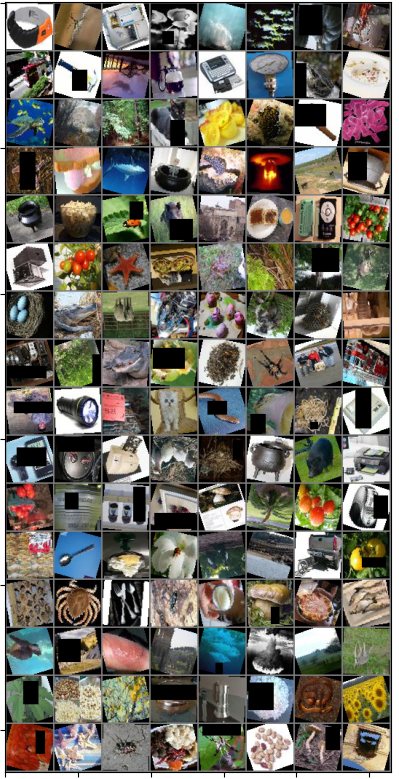

# 50-class img classification
## Taks
Implement classifier for images, there 50 classes (items, cars, animals etc.)

## Scores
implementation of model `classifier.py`

As feedback - accuracy on test data: `59%` (on 50 unbalanced classed)